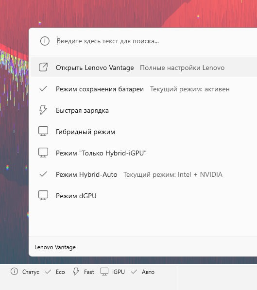

# Lenovo Legion Vantage Buttons for Command Palette

Quick Lenovo Vantage controls for the Windows Command Palette dock.

This extension adds a small dock panel with shortcuts for the Lenovo Vantage settings that are useful to change often:

- open Lenovo Vantage;
- toggle battery conservation mode;
- toggle rapid charge;
- switch GPU mode to Intel-only (`Hybrid-iGPU only`);
- switch GPU mode to automatic hybrid graphics (`Hybrid-Auto`);
- open a status page with the full set of supported GPU modes.

It was built because Lenovo Vantage is useful, but opening the full app just to switch charging or GPU modes is slow and distracting.



The screenshot above is from the original Russian setup. The public version of the extension uses English UI text.

## Tested Hardware

Tested on a Lenovo Legion 7 laptop.

Lenovo exposes these controls through model-specific WMI and energy-driver interfaces, so other Legion or Lenovo laptops may need small adjustments. Codex or another coding assistant can help adapt the controller methods for a different model.

## Features

- Battery controls:
  - `Eco` toggles battery conservation mode.
  - `Fast` toggles rapid charge.
  - Pressing the currently active charging mode again returns charging to normal.
- GPU controls:
  - `iGPU` selects the Lenovo `Hybrid-iGPU only` mode.
  - `Auto` selects the Lenovo `Hybrid-Auto` mode.
  - The status page also exposes `Hybrid mode` and `dGPU mode`.
  - Selecting `dGPU mode` shows a warning because Lenovo may require a restart.
- Status refresh:
  - The dock refreshes when it is opened and immediately after actions triggered from the dock.
  - Background polling is intentionally disabled to keep Command Palette memory usage low.

## Requirements

- Windows 11.
- PowerToys Command Palette.
- Lenovo Vantage and the Lenovo services/drivers that expose `LENOVO_GAMEZONE_DATA` and `EnergyDrv`.
- .NET SDK compatible with the target framework in the project.
- Windows App SDK / MSIX build tooling.

## Build

From the repository root:

```powershell
dotnet restore
dotnet publish .\LenovoVantageDockExtension\LenovoVantageDockExtension.csproj -c Release -p:Platform=x64 -p:GenerateAppxPackageOnBuild=true
```

For local sideloading, you will need to sign the MSIX with your own certificate. The manifest uses `CN=YourName` as a placeholder; replace it with the subject of your local signing certificate before packaging.

## Notes

- This is an unofficial community project.
- It is not affiliated with Lenovo, Microsoft, or PowerToys.
- If a GPU mode appears selected but the hardware did not fully switch, pressing the same GPU button again sends the Lenovo command again.

## Optional Rainmeter Idea

The original private setup also refreshed a personal Rainmeter desktop skin after GPU mode changes, so the desktop status block could show the NVIDIA GPU appearing or disappearing right away.

That integration is not included in this public version because it depends on a custom local Rainmeter layout. If you use Rainmeter or another always-visible desktop monitor, this project can still be a useful starting point: after a successful GPU mode switch, trigger your own refresh command or update hook.

## Keywords

Lenovo Legion, Lenovo Vantage, PowerToys Command Palette, Command Palette extension, Legion GPU mode, Hybrid-Auto, Hybrid-iGPU, rapid charge, battery conservation, Lenovo laptop controls, Rainmeter, Codex.
